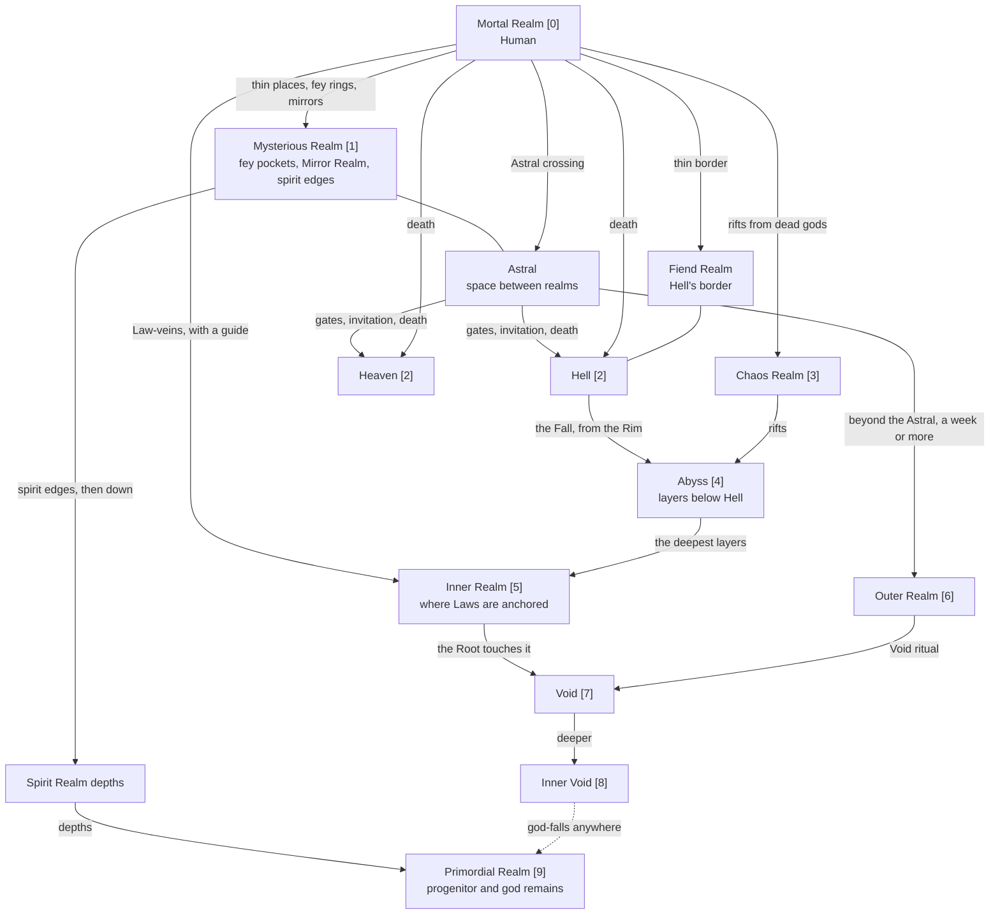

# Realm Map

How the realms of FAND connect, and how travelers get between them. Higher is harder: each realm's Pressure (0–9) is shown in brackets. Rules are in [[FAND/Atrious/Realm Travel|Realm Travel]].

## Reading the map
- **Solid arrows** are the usual routes, in the direction most travelers take them. Every route also works in reverse, but leaving is often harder than arriving (see "Getting home" in Realm Travel).
- **The Astral** and **the Fiend Realm** are crossing zones, not tiers of their own.
- **God-falls** (dotted) can open onto the Primordial Realm from anywhere an original god died.
- Each god's home realm is in the [[FAND/Atrious/God Roster|God Roster]]; a god's invitation reaches it from anywhere.

## Realm pages
[[Mortal Realm]] · [[Mysterious Realm]] · [[Astral]] · [[Hell]] · [[Fiend Realm]] · [[Heaven]] · [[Chaos Realm]] · [[Abyss]] · [[Inner Realm]] · [[Outer Realm]] · [[Void]] · [[Inner Void]] · [[Spirit Realm]] · [[Primordial Realm]]

## Related
- [[FAND/Atrious/Realm Travel|Realm Travel]] · [[FAND/Atrious/Material Grading|Material Grading]] · [[FAND/Atrious/Material Index|Material Index]]
